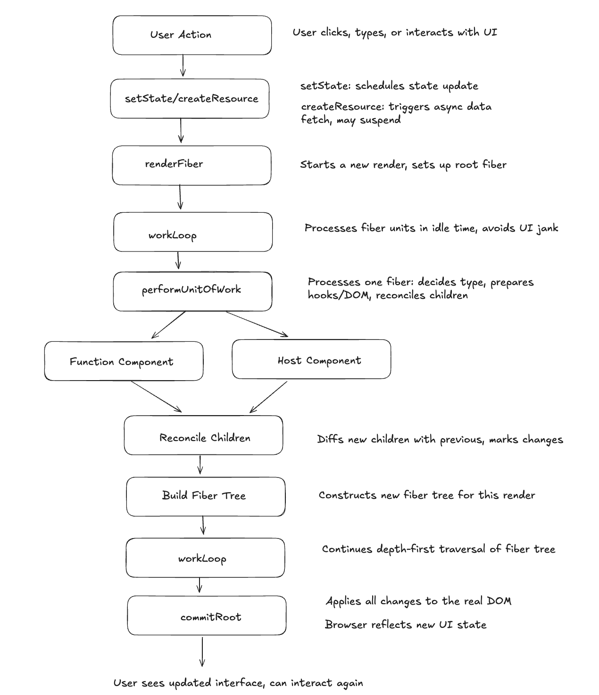

# ReactLite

this is my tiny “react-ish” renderer that I wrote to learn how React works under the hood.

**not production, not a library, not trying to compete with react**  
this is mainly me learning fiber, hooks, lazy resources, scheduling, diffing, etc.

I basically built a very small react-like engine:

- fiber tree
- incremental work loop (requestIdleCallback polyfill)
- diffing children (reconciliation)
- commit phase (dom patching)
- useState (no effects)
- suspense-style async resource (throw promise)

---

## why I built this

react feels magical if you only ever use it.  
I wanted to remove the fog and literally learn the mechanics.

---

## features

| feature                          | supported |
| -------------------------------- | :-------: |
| function components              |    ✅     |
| useState                         |    ✅     |
| async resource (simple suspense) |    ✅     |
| diff children + reconcile        |    ✅     |
| fiber work loop (yielding)       |    ✅     |

## core flow illustration

